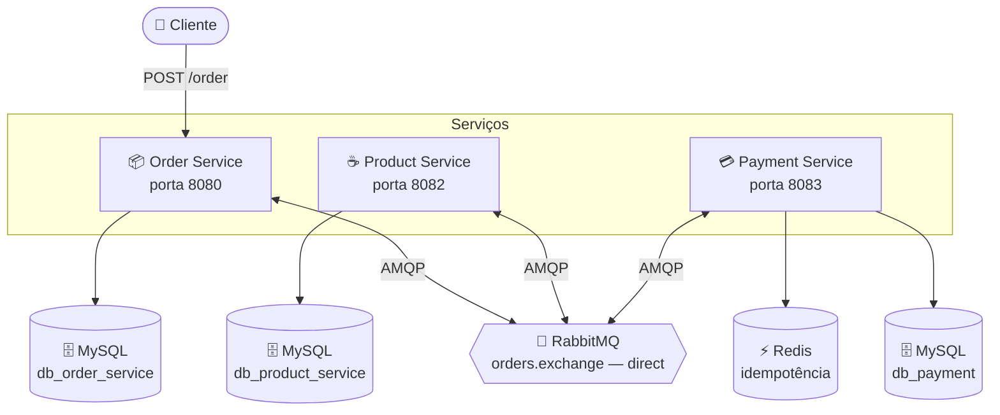
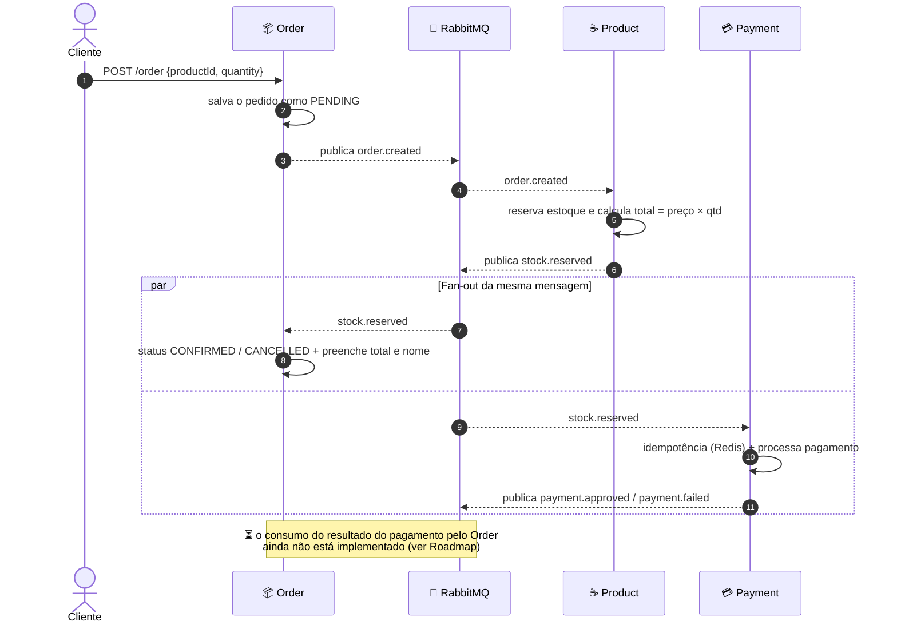

# ☕ Gestão de Pedidos — Microsserviços com Saga Assíncrona


Sistema de e-commerce (uma **cafeteria** ☕) construído com **arquitetura de microsserviços** e comunicação **assíncrona via mensageria**. O ciclo de vida de um pedido — criação, reserva de estoque e pagamento — é orquestrado por uma **saga coreografada** sobre o RabbitMQ, sem chamadas REST síncronas entre os serviços.

> 🎯 Projeto de estudo focado em boas práticas de sistemas distribuídos: baixo acoplamento, cada serviço dono do seu banco (*database per service*), eventos de integração e idempotência.

---

## 📖 Índice

- [Arquitetura](#-arquitetura)
- [Fluxo da saga](#-fluxo-da-saga-coreografia)
- [Stack / Tecnologias](#-stack--tecnologias)
- [Estrutura do repositório](#-estrutura-do-repositório)
- [Como rodar](#-como-rodar)
- [Endpoints da API](#-endpoints-da-api)
- [Catálogo (seed)](#-catálogo-de-cafés-seed)
- [Exemplo de uso ponta a ponta](#-exemplo-de-uso-ponta-a-ponta)
- [Roadmap](#-roadmap--próximos-passos)
- [Autor](#-autor)

---

## 🏛️ Arquitetura

Três serviços Spring Boot independentes, cada um com seu **próprio banco MySQL**, conversando por uma única *exchange* do RabbitMQ (`orders.exchange`, do tipo **direct**). O Payment ainda usa o **Redis** para garantir idempotência.



Cada serviço acumula **dois papéis** ao mesmo tempo: é *producer* (publica eventos) **e** *consumer* (escuta eventos) — são responsabilidades diferentes, em classes diferentes.

| Serviço | Publica | Escuta |
|---|---|---|
| **Order** | `order.created` | `stock.reserved` |
| **Product** | `stock.reserved` | `order.created` |
| **Payment** | `payment.approved` / `payment.failed` | `stock.reserved` |

---

## 🔄 Fluxo da saga (coreografia)

Quem tem o dado é quem manda: o **cliente envia apenas `productId` + `quantity`**, e todo o resto (preço, total, nome do produto) é calculado pelo serviço dono daquela informação — nunca aceito do cliente.



**Passo a passo:**

1. `POST /order` com `productId` e `quantity` → o Order salva o pedido como **`PENDING`** (com `valueTotal` e `productName` ainda `null`) e publica **`order.created`**. É *dispara e esquece*: não espera resposta.
2. O **Product** consome `order.created`, tenta **reservar o estoque**, calcula o **total** (`preço × quantidade`) e publica **`stock.reserved`** com o resultado (`reserved`, `productName`, `valueTotal`).
3. `stock.reserved` sofre **fan-out**: uma cópia vai para a fila do Order e outra para a do Payment.
   - O **Order** finaliza o pedido → **`CONFIRMED`** (ou **`CANCELLED`** se faltou estoque) e preenche o total e o nome que só o Product conhecia.
   - O **Payment** confere a **idempotência no Redis** (para não cobrar duas vezes o mesmo pedido), processa o pagamento e publica **`payment.approved`** ou **`payment.failed`**.

---

## 🧰 Stack / Tecnologias

- **Java 21** + **Spring Boot 4.1.0**
- **Spring Web (MVC)** — API REST
- **Spring Data JPA** + **Hibernate** — persistência
- **Spring AMQP / RabbitMQ** — mensageria assíncrona (saga)
- **Spring Data Redis** — idempotência de pagamento (Payment Service)
- **MySQL 8** — um banco por serviço
- **MapStruct 1.6.3** — mapeamento DTO ↔ entidade
- **Lombok** — redução de boilerplate
- **Bean Validation** — validação nos DTOs de entrada
- **Docker Compose** — infraestrutura local (MySQL, RabbitMQ, Redis)
- **Maven** (com wrapper `mvnw` incluso)

---

## 📁 Estrutura do repositório

```
Gestão de Pedidos/
├── Order Service/      # 📦 Pedidos — API REST + orquestração da saga
├── Product Service/    # ☕ Catálogo e estoque — cálculo do total
└── Payment Service/    # 💳 Pagamento — idempotência com Redis
```

Dentro de cada serviço, os pacotes seguem o mesmo padrão em camadas:

```
controller/   # endpoints REST
service/      # regras de negócio
repository/   # acesso a dados (Spring Data JPA)
model/        # entidades JPA
dtos/         # objetos de entrada/saída da API
mapper/       # MapStruct (entidade ↔ DTO)
event/        # contratos de mensagem (records) da saga
producer/     # publica eventos no RabbitMQ
consumer/     # escuta eventos do RabbitMQ
config/       # exchange, filas, bindings, seed
handler/      # tratamento global de exceções
```

---

## ▶️ Como rodar

### Pré-requisitos

- **JDK 21**
- **Docker** + **Docker Compose**
- **Maven** (ou use o wrapper `./mvnw` que já vem em cada serviço)

### 1. Suba a infraestrutura

Os serviços compartilham o **mesmo** MySQL (`localhost:3306`), o **mesmo** RabbitMQ (`localhost:5672`) e o Redis (`localhost:6379`). O `docker-compose.yml` do **Payment Service** já inclui os três — então ele cobre toda a infra:

```bash
cd "Payment Service"
docker compose up -d
```

- Os bancos `db_order_service`, `db_product_service` e `db_payment` são criados automaticamente (`createDatabaseIfNotExist=true`).
- Painel do RabbitMQ: <http://localhost:15672> — usuário/senha `guest` / `guest`.

> 💡 As credenciais (`root` / `guest`) são padrões de **desenvolvimento local**.

### 2. Rode os serviços

Em três terminais, um por serviço:

```bash
# Terminal 1 — Product (sobe o catálogo de cafés na primeira execução)
cd "Product Service" && ./mvnw spring-boot:run

# Terminal 2 — Order
cd "Order Service" && ./mvnw spring-boot:run

# Terminal 3 — Payment
cd "Payment Service" && ./mvnw spring-boot:run
```

| Serviço | Porta | Banco |
|---|---|---|
| Order Service | `8080` | `db_order_service` |
| Product Service | `8082` | `db_product_service` |
| Payment Service | `8083` | `db_payment` |

---

## 🌐 Endpoints da API

### 📦 Order Service — `http://localhost:8080`

| Método | Rota | Descrição |
|---|---|---|
| `POST` | `/order` | Cria um pedido e **dispara a saga** |
| `GET` | `/order/{id}` | Busca um pedido por ID |
| `GET` | `/order` | Lista pedidos (paginado) |
| `PUT` | `/order/{id}` | Atualiza um pedido |
| `DELETE` | `/order/{id}` | Remove um pedido |

**Corpo do `POST /order`:**

```json
{
  "productId": "11111111-1111-1111-1111-111111111111",
  "quantity": 2
}
```

### ☕ Product Service — `http://localhost:8082`

| Método | Rota | Descrição |
|---|---|---|
| `POST` | `/product` | Cadastra um produto |
| `GET` | `/product/{id}` | Busca um produto por ID |
| `GET` | `/product` | Lista produtos (paginado) |
| `PUT` | `/product/{id}` | Atualiza um produto |
| `DELETE` | `/product/{id}` | Remove um produto |

**Corpo do `POST /product`:**

```json
{
  "name": "Macchiato",
  "price": 8.50,
  "stockQuantity": 30
}
```

### 💳 Payment Service — `http://localhost:8083`

| Método | Rota | Descrição |
|---|---|---|
| `GET` | `/payment/{id}` | Busca um pagamento por ID |
| `GET` | `/payment` | Lista pagamentos (paginado) |

> Pagamentos são criados **pela saga** (ao consumir `stock.reserved`), não por um endpoint de escrita.

---

## ☕ Catálogo de cafés (seed)

Ao subir com o banco vazio, o Product popula o catálogo com **IDs fixos e fáceis de decorar** (ótimos para testar sem precisar consultar o `GET /product` toda vez):

| Produto | `productId` | Preço | Estoque |
|---|---|---|---|
| Espresso Simples | `11111111-1111-1111-1111-111111111111` | R$ 7,00 | 50 |
| Espresso Duplo | `22222222-2222-2222-2222-222222222222` | R$ 9,00 | 50 |
| Ristretto | `33333333-3333-3333-3333-333333333333` | R$ 8,00 | 50 |
| Lungo | `44444444-4444-4444-4444-444444444444` | R$ 8,00 | 50 |

---

## 🧪 Exemplo de uso ponta a ponta

**1) Criar um pedido de 2 Espressos Duplos:**

```bash
curl -X POST http://localhost:8080/order \
  -H "Content-Type: application/json" \
  -d '{ "productId": "22222222-2222-2222-2222-222222222222", "quantity": 2 }'
```

O pedido volta imediatamente como `PENDING` (a saga roda em background).

**2) Consultar o pedido segundos depois** (use o `orderID` devolvido acima):

```bash
curl http://localhost:8080/order/{orderID}
```

Agora o status é **`CONFIRMED`**, com `productName = "Espresso Duplo"` e `valueTotal = 18.0` — preenchidos pelo Product na volta da saga.

**3) Ver o pagamento gerado:**

```bash
curl http://localhost:8083/payment
```

---

## 🗺️ Roadmap / Próximos passos

- [ ] **Fechar o ciclo do pagamento:** o Order consumir `payment.approved` / `payment.failed` para marcar o pedido como `PAID` / `PAYMENT_FAILED`.
- [ ] **Compensação da saga:** devolver o estoque quando o pagamento falhar.
- [ ] Trocar `Double` por **`BigDecimal`** nos valores monetários.
- [ ] DTO próprio para o `PUT /order` (hoje reaproveita o de resposta).
- [ ] **Dead Letter Queue (DLQ)** e política de *retry* para mensagens com erro.
- [ ] Documentação da API com **OpenAPI / Swagger**.
- [ ] `docker-compose` unificado na raiz e *containerização* dos serviços.
- [ ] Conectar o **frontend** da cafeteria.

---

## 👤 Autor

**Bruno Bandeira**
[](https://github.com/BrunodevBandeira)

> Projeto desenvolvido para estudo de **microsserviços, mensageria e sagas** com o ecossistema Spring.
